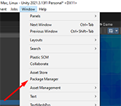
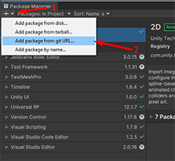
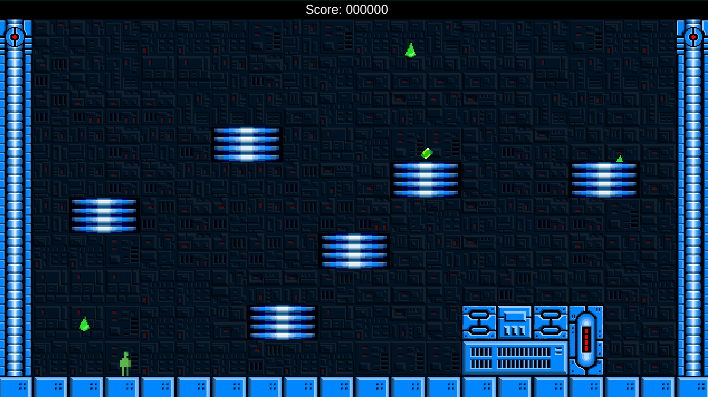
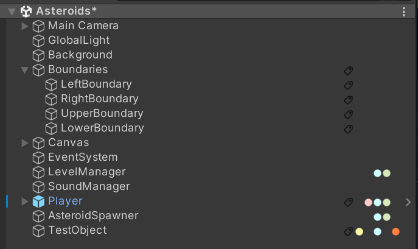
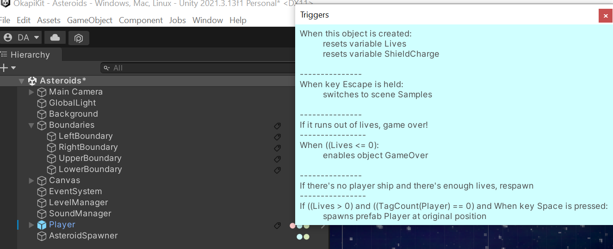

# OKAPI KIT

This is a series of premade scripts intended for kit bashing of quick game development experiments for the  [Licenciatura em Videojogos][lv] da [Universidade Lusófona de Humanidades e Tecnologias][ULHT] in Lisbon.

It's currently still under development, and eventually will be commented properly, and have a manual.

#
# Installation

## Option 1 - Super-simple, less useful

You can simply create a fork of this repository or download it and start working!

## Option 2 - Unity Package Manager

Use the Unity Package Manager to install the OkapiKit:

1. Open the Unity Package Manager

2. Select "Add package from git URL"

3. First install Naughty Attributes, by pasting the URL "https://github.com/dbrizov/NaughtyAttributes.git#upm"

4. You can now install the OkapiKit, selecting again "Add package from git URL", and pasting the URL "https://github.com/VideojogosLusofona/OkapiKit.git#upm"

5. If you want to install the samples as well, select again "Add package from git URL", and pasting the URL "https://github.com/VideojogosLusofona/OkapiKit.git#samples"

6. With this option, everytime you want to update the package, you will have to remove it and re-add it (the Update option doesn't work properly in this context)

## Option 3 - More complicated, best option - UpmGitExtension

Use the UPM Git extension to install the OkapiKit:

1. Open the Unity Package Manager

2. Select "Add package from git URL"

3. Install the UPM Git Extension, by pasting the URL "https://github.com/mob-sakai/UpmGitExtension.git"

4. You can now install Naughty Attributes, selecting again "Add package from git URL", and pasting the URL "https://github.com/dbrizov/NaughtyAttributes.git#upm"

5. Finally, install the OkapiKit, selecting again "Add package from git URL", and pasting the URL "https://github.com/VideojogosLusofona/OkapiKit.git#upm"

6. If you want to install the samples, select again "Add package from git URL", and pasting the URL "https://github.com/VideojogosLusofona/OkapiKit.git#samples"

7. When you want to update, just use the Update button.

# Sample

It currently has seven sample 'games' (each a Scene under the Samples directory), accessible through a menu (Samples scene, also in the Samples directory).
There are also some code snippets demonstrating some of the features, but devoid of any meaningful context. The Snippets menu can be accessed through the Samples scene.

## Using the samples if you installed them as a package

Due to the way packages work in Unity, you can't open the sample scenes from the package.
To sidestep this issue, you have to follow some steps:

1. Go to the Packages/OkapiKitSamples folder in your project view

2. Copy all the scenes that you want to explore to your own project
  - The relevant scenes are Samples and Snippets for the base menus, the individual scenes for each of the sample games (inside the folder) and the scenes inside the Snippets directory.

3. Add all scenes to the build menu (or else they links between scenes won't work)

## Pong

## Breakout

## Space Invaders

## "Procedural" side scrolling shoot'em'up

## Asteroids

## Commando

## Platformer acid drip

## Snippets

- Probe: 
  - probe usage
- StoppingDistance
  - how to use the stopping distance property on the Follow movement
- SingletonSoundManagerA/B
  - how to use the singleton system in the OkapiKit
  - how to keep a song playing throughout the game, even if it has multiple scenes
  - how to use a button to change the music playing
- FuzzyAim:
  - Demonstrate how to make a system for mouse aiming which is more precise the more time you press the fire button
  - Uses paths in a creating way
- Alternate World:
  - Demonstrates how to create an alternative world system, in which the player can't cross over if there will be a
    collision

# Documentation

For now, there's no documentation yet, but everything has custom editors, which display information on what each thing is doing (dynamically, depending on options selected):

In this image, we can see a bit of the inspector of a normal object (the player object in the asteroids sample). There's the normal Unity components (Sprite Renderer, Rigidbody, Collider), and then we have 
several Okapi Kit components (identifiable by the large title). We have a movement script (rotation movement), an hypertag (allows to define what this object is, usefull to identify objects in collisions or
as targets for operations), we have a collision Trigger (with the text that explains when it triggers,
and what happens), and finally we have several Action scripts (used by the Triggers), that also explain what they're doing.

There's also some icons on the Hierarchy view, indicating which type of Okapi object that objects has:

Placing the mouse cursor on top of any of the icons will display additional information. For example, here we placed the
cursor on top of the Trigger icon (blue dot) on the Player object and we can see all the triggers that it has.

#
# Licenses

* All source code by Diogo Andrade is licensed under the [MIT] license.
* Font "Karmatic Arcade" by [Vic Fieger]
* Breakout paddle by [Zealex], licensed under [CC-BY 3.0]
* Breakout bricks by [Pavel Kutejnikov], licensed under [CC0]
* Space Invaders enemies and player by [Clear_code], licensed under [CC-BY 4.0]
* Tiles for space shooter by [mieki256], licensed under [CC0]
* Space ships for space shooter by [SCaydi], licensed under [CC-BY 4.0]
* Explosion by [Joshua Robertson], licensed under [CC-BY 3.0]
* Top down ships by [Master484], licensed under [CC0]
* Asteroid by [Warspawn], licensed under [CC0]
* Nebula background by [leyren], licensed under [CC0]
* Desert texture by [pansapiens], licensed under [CC0]
* Survivor top down sprites by [rileygombart], licensed under [CC-BY 3.0]
* Top-down buildings by [chabull], licensed under [CC-BY 3.0]
* Platformer sprites by [IMakeGames], licensed under [CC-BY 3.0]
* Gems by [Winternaut], licensed under [CC0]
* NES Shooter Music by [SketchyLogic], licensed under [CC0]
* Editor icons from [FlatIcon]
* Title imagem from [Midjourney]
* [NaughtyAttributes] by Denis Rizov, available through the MIT license.

#
# Metadata

* Autor: [Diogo Andrade]

[Diogo Andrade]:https://github.com/DiogoDeAndrade
[NaughtyAttributes]:https://github.com/dbrizov/NaughtyAttributes
[ULHT]:https://www.ulusofona.pt/
[lv]:https://www.ulusofona.pt/licenciatura/videojogos
[Vic Fieger]:http://www.vicfieger.com/
[Zealex]:https://opengameart.org/users/zealex
[Pavel Kutejnikov]:https://opengameart.org/users/kutejnikov
[Clear_code]:https://opengameart.org/users/clearcode
[mieki256]:https://opengameart.org/users/mieki256
[SCaydi]:https://opengameart.org/users/scaydi
[Joshua Robertson]:https://opengameart.org/users/jrob774
[Master484]:http://m484games.ucoz.com/
[Warspawn]:https://opengameart.org/users/warspawn
[pansapiens]:https://opengameart.org/users/pansapiens
[rileygombart]:https://opengameart.org/users/rileygombart
[chabull]:https://opengameart.org/users/chabull
[IMakeGames]:http://www.imake-games.com/
[Winternaut]:https://opengameart.org/users/winternaut
[SketchyLogic]:https://opengameart.org/users/sketchylogic
[CC0]:https://creativecommons.org/publicdomain/zero/1.0/
[CC-BY 3.0]:https://creativecommons.org/licenses/by/3.0/
[CC-BY 4.0]:https://creativecommons.org/licenses/by/4.0/
[MIT]:LICENSE
[FlatIcon]:Flaticon.com
[Midjourney]:https://midjourney.com/