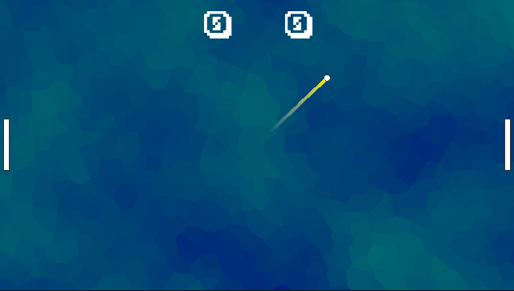
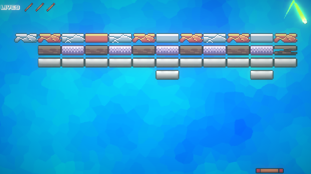
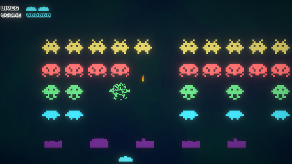
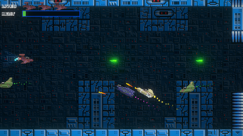
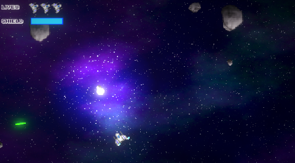
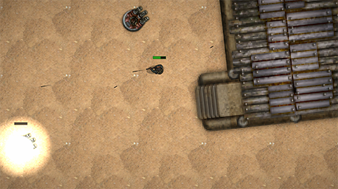
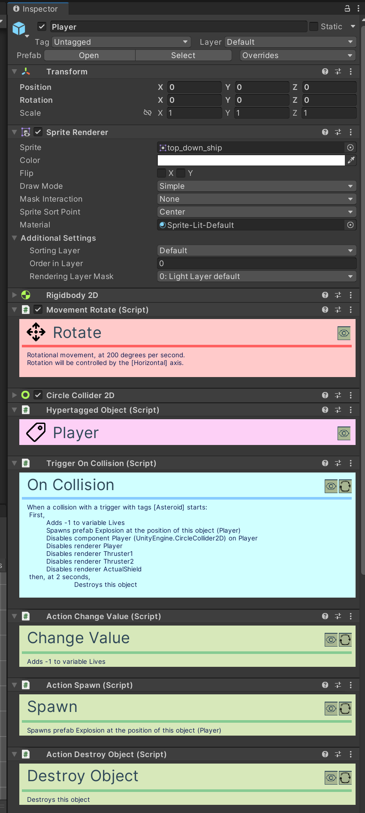

# OKAPI KIT

This is a series of premade scripts intended for kit bashing of quick game development experiments for the  [Licenciatura em Videojogos][lv] da [Universidade Lusófona de Humanidades e Tecnologias][ULHT] in Lisbon.

It's currently still under development, and eventually will be commented properly, and have a manual.

# Samples

It currently has six sample 'games' (each a Scene under the Samples directory), accessible through a menu (Samples scene, also in the Samples directory).

## Pong 

## Breakout

## Space Invaders

## "Procedural" side scrolling shoot'em'up 

## Asteroids

## Commando

# Documentation

For now, there's no documentation yet, but everything has custom editors, which display information on what each thing is doing (dynamically, depending on options selected):

In this image, we can see a bit of the inspector of a normal object (the player object in the asteroids sample). There's the normal Unity components (Sprite Renderer, Rigidbody, Collider), and then we have 
several Okapi Kit components (identifiable by the large title). We have a movement script (rotation movement), an hypertag (allows to define what this object is, usefull to identify objects in collisions or
as targets for operations), we have a collision Trigger (with the text that explains when it triggers,
and what happens), and finally we have several Action scripts (used by the Triggers), that also explain what they're doing.

# Licenses

* All source code by Diogo Andrade is licensed under the MIT license.
* Font "Karmatic Arcade" by [Vic Fieger]
* Breakout paddle by [Zealex], licensed under [CC-BY 3.0]
* Breakout bricks by [Pavel Kutejnikov], licensed under [CC0]
* Space Invaders enemies and player by [Clear_code], licensed under [CC-BY 4.0]
* Tiles for space shooter by [mieki256], licensed under [CC0]
* Space ships for space shooter by [SCaydi], licensed under [CC-BY 4.0]
* Explosion by [Joshua Robertson], licensed under [CC-BY 3.0]
* Top down ships by [Master484], licensed under [CC0]
* Asteroid by [Warspawn], licensed under [CC0]
* Nebula background by [leyren], licensed under [CC0]
* Desert texture by [pansapiens], licensed under [CC0]
* Survivor top down sprites by [rileygombart], licensed under [CC-BY 3.0]
* Top-down buildings by [chabull], licensed under [CC-BY 3.0]
* Editor icons from [FlatIcon]
* Title imagem from [Midjourney]
* [NaughtyAttributes] by Denis Rizov, available through the MIT license.

# Metadata

* Autor: [Diogo Andrade]

[Diogo Andrade]:https://github.com/DiogoDeAndrade
[NaughtyAttributes]:https://github.com/dbrizov/NaughtyAttributes
[ULHT]:https://www.ulusofona.pt/
[lv]:https://www.ulusofona.pt/licenciatura/videojogos
[Vic Fieger]:http://www.vicfieger.com/
[Zealex]:https://opengameart.org/users/zealex
[Pavel Kutejnikov]:https://opengameart.org/users/kutejnikov
[Clear_code]:https://opengameart.org/users/clearcode
[mieki256]:https://opengameart.org/users/mieki256
[SCaydi]:https://opengameart.org/users/scaydi
[Joshua Robertson]:https://opengameart.org/users/jrob774
[Master484]:http://m484games.ucoz.com/
[Warspawn]:https://opengameart.org/users/warspawn
[pansapiens]:https://opengameart.org/users/pansapiens
[chabull]:https://opengameart.org/users/chabull
[CC0]:https://creativecommons.org/publicdomain/zero/1.0/
[CC-BY 3.0]:https://creativecommons.org/licenses/by/3.0/
[CC-BY 4.0]:https://creativecommons.org/licenses/by/4.0/
[FlatIcon]:Flaticon.com
[Midjourney]:https://midjourney.com/